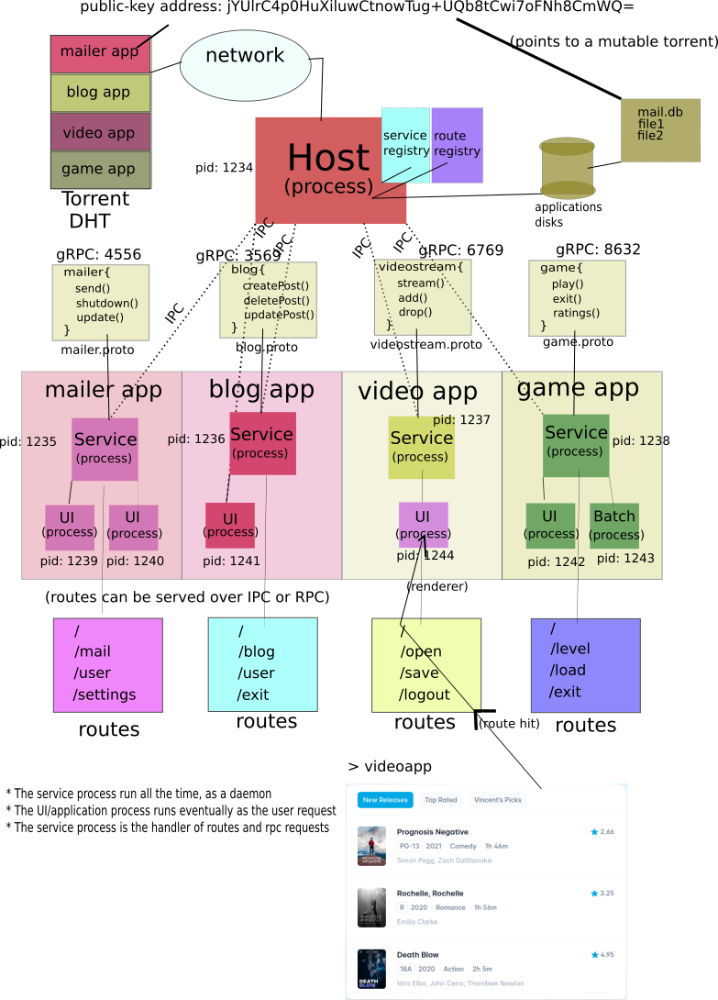

Mumba 
======
The p2p application web platform
------

What is it?
------

* A organic application platform where all applications can coexist and communicate in a standard way 
  exposing the popular web api directly to native applications. 

  (You can think on it as a mix of a userspace OS + mobile application platform + browser)

* A multiprocess "userspace kernel" that takes care of running and managing applications
  forming a network of applications, where resources can be shared, and where they can all be clients of one another by
  consuming the public RPC api exposed by each application.

  For instance, if the media player application wants to send a email, it can use the mailer application rpc
  api.

  (If Mumba turns to be a hit, as i hope so, a natural outcome is for applications to adhere to common api's for popular things,
   so a abstract base interface for usual things can be used independently of the real application implementing it
   and handling it. eg. "Mail Api 0.1" being implemented by the 'MyMail' app)

* Each application have at least a daemon process which serve gRPC api's and 
  answer for route requests from the UI clients via IPC or RPC
  The daemon process also manage the application launches which are full-blown
  web-based UI applications (in their own processes).

* The web api's are exposed directly to the native application, which is much more powerfull than
  the current Javascript ones given the UI application have direct access to the web frame api
  with the same power as the C++ 'renderer' process in Chrome.

* Multiples native applications SDK's are feasible. The Swift one is the first one that is ready.

* Applications are distributed over torrent DHT, with permanent addresses without the need
  of third-parties for application and data distribution. You can create apps and share them
  right away from your computer.

* Applications will run as if they were native, with executable "frontends" which are shim rpc clients 
  which communicate with the mumba's mothership(host process) over RPC and without users even noticing 
  that theres a whole platform managing yours and others applications

* With a central manager process a lot of other things are possible, and thats why we call it 
  "application network", because each application can access public resources from other applications
  on the same host, as with RPC' api's application routes or the automation IPC api.
  In practive what the developer gets, its the capacity to create very sophisticated applications
  with a greater productivity and with much less lines of code and complexity.

* With multiple RPC api's exposed in each node, distributed applications that combine the same api's 
  in several nodes are possible in a p2p fashion.

* As applications expose and handle gRPC api's, clients that consume that api
  can be created with other languages with gRPC libraries like Go or Python. 
  You wont need to ask permission for the next Twitter or Youtube to create a API for you,
  you only need the permission from the user of each peer

* A storage layer which can serve a file, key-value and sql database api to the applications
  but that is also distributed over torrent, making all the storage a applications use
  (be it files or databases) available to other nodes in a p2p way. 
  In practice you can create a application sharing the same database over all the peers 
  that have your application installed and having them to update the data over torrent.

  This storage layer is actually how applications are distributed over torrent, with their optional assets.
  But new files and databases can be created and shared over after the original storages are being
  seeded over the bit-torrent network

* its meant as a web.next platform. The next step combining the power of browsers and mobile platforms
  but with a peer-to-peer distribution process which put the power of creating, distributing, 
  sharing and downloading things back in the hand of everyone.

  The classic web have a technical design flaw that leads to the economical concentration of power we see today.
  In order to give back the power to ordinary people, giving them the means and independency to do what they dream
  theres a need for the distribution to have no middle-man, no hasless and no obligatory clouds. Clouds can be used
  of course but they get to be proxyfied by the application daemons and the users dont even need to know the details
  (if its going local, distributed or over the traditional cloud).

  The way this works, is about the "power of indirection". Its the same way how our brain represents the world
  we know "locally" through references to things, representations. The idea is that the application always talk to 
  its service(which is also programmed as the UI application) first which decides what to do according to its goals.

  If it needs to reach the network and how, the client application running in the same host doesnt need to know about it
  from the application point of view that is always accessing the same entry point, and the service process can
  have fallbacks once things on network dont work as intended. 

What you can do with it? What is it for?
------
  
  A distributed twitter? 

  So, do you mean Mastodon? 

  No. Mastodon is federated. this "distributed whatever" can use its own desined gRPC's distributed on every user node
  communicating with them in a p2p fashion. 
    
  You can create a distributed database, a CRDT editor, a multiplayer game or a distributed search engine that can search
  on each peer's data, with the user permission of course. 

  You can use RPC to leverage/bootstrap other low latency protocols like UDP, WebRTC or WebSockets if RPC is not a good fit.
  But having a common ground to form a network of peers with the same api can a wonderful launchpad for distributed application

  Of course, you can distribute normal local applications or applications that consume and render consuming other apis from the network, it doesnt need to be fancy as a distributed storage application, but the potential is there and you can use it
  as you grow.

  How do you connect to other peers with the same api? 

  Well, all users of a application share the same torrent (say myapp_v01)
  all others peers that share and have it fully sinced are probably running the same service.

  Once you get the peers who share the same torrent, there's a SD service that will tell you 
  if the service is really running and at what port, so you can add it to a list of peers 
  and use it however you wish according to your goals. You will use Raft? P2P? Gossip?

  For now our SDK will provide forms of peer listing and service discovery informing about the service.
  With this information, and giving theres a well-known designed API over gRPC, its left to the developers
  how to proceed. Maybe in the future common forms of forming distributed applications with peers can be aided
  with the SDK.

Architecture
-----

RPC Apis
-----

  Every application have a service/daemon process which is always running like a service
  and which is responsible to answer for RPC and Route requests, among any other things
  a running daemon is suitable for.

Routes
-----

SDK
-----

Swift

  Source is at [kit/swift](https://github.com/mumba-org/mumba/tree/main/kit/swift)

  Documentation is (a TODO)

  example UI application code:

  [tweedy ui sources](https://github.com/mumba-org/mumba/blob/main/apps/tweedy/app/Sources)

  [tweedy main](https://github.com/mumba-org/mumba/blob/main/apps/tweedy/app/Sources/TweedyMain.swift)
  
  (Caveat: it was my test ground for features, so theres a lot of different stuff in there:
            service workers, offscreen canvas, webgl, media, websockets, paint api, RPC client, etc)

  Note: that guy will form the final executable that runs as the renderer. It have access to the web frames
        the same way a C++ renderer process in chrome, and it have access to a lot of events that comes from the 
        webkit side, making it a application with a lot of power and control. (You cant have that with Electron for instance)

  example service code:

  [tweedy service sources](https://github.com/mumba-org/mumba/blob/main/apps/tweedy/service/Sources)

  [tweedy context](https://github.com/mumba-org/mumba/blob/main/apps/tweedy/service/Sources/TweedyContext.swift)

  [tweedy provider](https://github.com/mumba-org/mumba/blob/main/apps/tweedy/service/Sources/TweedyProvider.swift)

  [tweedy route handlers](https://github.com/mumba-org/mumba/blob/main/apps/tweedy/service/Sources/Handlers.swift)

  (Note: context and provider will merge into the same thing into the future (the service entry point/manager))

How is this similar/different from
------

* Electron

  Similar: 
    * You can build and distribute applications that can run on multiple platforms
    * You can use the web api's to develop applications

  Different: 
    * The user will have a mumba distribution (or the dev will embedd one as a safety measure if the user have none),
      the same way you have a chrome or firefox to open the web.
      
      The user dont need to know about this implementation detail, as him/her will run your application
      executable (that is just a RPC client that is customized to call the laucher RPC api) and your application window
      will just pop in front of him/her. (The idea is that even though a Mumba host process is essential to form the organic
      platform where all applications can coexist and communicate, it should get out of the way, and help your application to shine,
      without the user even noticing it)

      
      With this, there's a manager process and only one GPU process for all apps, 
      this together with the application talking directly with the Webkit API (no javascript) 
      will create a application that is lighter, giving its all reused for other applications
      that runs on the same umbrella.

    * You will use the web api nativelly, without any Javascript or WebAssembly involved.
      The first SDK is available for Swift (the Javascript api is still there of course if you want to use it).

    * With the service process, your app will still be running even if the user did not launch any UI applications
      so you can still do some work.. and also define how to handle RPC and Route requests, managing the UI application
      processes that are eventually launched.

* Mobile Platforms: Android/iOS  

* Browsers

* "Web3" 

Documentation
-----

Building
-----

  We use Chrome's gn for generating ninja build files and then ninja from there.
  Our gn's is a fork from the original which also allow us to build Swift sources
  to build the sdk or applications

Creating your applications
-----

Distributing your applications
-----
  
Screenshots and videos
-----    
