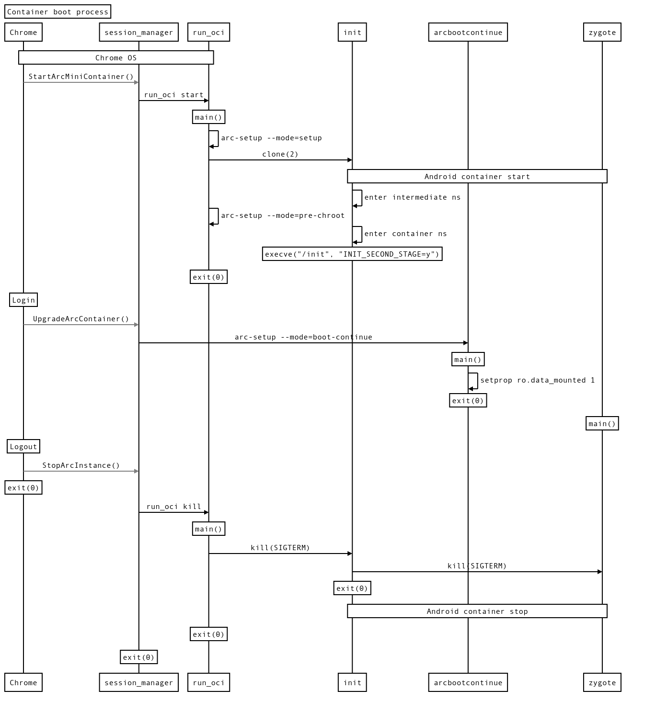

# Android container in Chrome OS

This document outlines the process by which Android runs in a Linux container in
Chrome OS.

This document explains how the container for Android P works.

## config.json

`config.json` is used by
[`run_oci`](https://chromium.googlesource.com/chromiumos/platform2/+/HEAD/run_oci/),
to describe how the container is set up. This file describes the mount
structure, namespaces, device nodes that are to be created, cgroups
configuration, and capabilities that are inherited.

## Namespaces

Android is running using all of the available Linux
[`namespaces(7)`](http://man7.org/linux/man-pages/man7/namespaces.7.html) to
increase isolation from the rest of the system:

* [`cgroup_namespaces(7)`](http://man7.org/linux/man-pages/man7/cgroup_namespaces.7.html)
* IPC (for System V IPC)
* [`mount_namespaces(7)`](http://man7.org/linux/man-pages/man7/mount_namespaces.7.html)
* [`network_namespaces(7)`](http://man7.org/linux/man-pages/man7/network_namespaces.7.html)
* [`pid_namespaces(7)`](http://man7.org/linux/man-pages/man7/pid_namespaces.7.html)
* [`user_namespaces(7)`](http://man7.org/linux/man-pages/man7/user_namespaces.7.html)
* UTS (for hostname and domain name)

Running all of Android's userspace in namespaces also increases compatibility
since we can provide it with an environment that is closer to what it expects to
find under normal circumstances.

`run_oci` starts in the init namespace (which is shared with most of Chrome OS),
running as real root with all capabilities. The mount namespace associated with
that is referred to as the **init mount namespace**. Any mount performed in the
init mount namespace will span user sessions and are performed before `run_oci`
starts, so they do not figure in `config.json`.

First, `run_oci` creates a mount namespace (while still being associated with
init's user namespace) that is known as the **intermediate mount namespace**.
Due to the fact that when it is running in this namespace it still has all of
root's capabilities in the init namespace, it can perform privileged operations,
such as performing remounts (e.g. calling `mount(2)` with `MS_REMOUNT` and
without `MS_BIND`), and requesting to mount a
[`tmpfs(5)`](http://man7.org/linux/man-pages/man5/tmpfs.5.html) into Android's
`/dev` with the `dev` and `exec` flags.  This intermediate mount namespace is
also used to avoid leaking mounts into the init mount namespace, and will be
automatically cleaned up when the last process in the namespace exits. This
process is typically Android's init, but if the container fails to start, it can
also be `run_oci` itself.

Still within the intermediate mount namespace, the container process is created
by calling the [`clone(2)`](http://man7.org/linux/man-pages/man2/clone.2.html)
system call with the `CLONE_NEWPID` and `CLONE_NEWUSER` flags. Given that mount
namespaces have an owner user namespace, the only way that we can transition
into both is to perform both simultaneously. Since Linux 3.9, `CLONE_NEWUSER`
implies `CLONE_FS`, so this also has the side effect of making this new process
no longer share its root directory
([`chroot(2)`](http://man7.org/linux/man-pages/man2/chroot.2.html)) with any
other process.

Once in the container user namespace, the container process enters the rest of
the namespaces using
[`unshare(2)`](http://man7.org/linux/man-pages/man2/unshare.2.html) system call
with the appropriate flag for each namespace. After it performs this with the
`CLONE_NEWNS` flag, it enters the a mount namespace which is referred to as the
**container mount namespace**. This is where the vast majority of the mounts
happen. Since this is associated with the container user namespace and the
processes here no longer run as root in the init user namespace, some operations
are no longer allowed by the kernel, even though the capabilities might be set.
Some examples are remounts that modify the `exec`, `suid`, `dev` flags.

Once `run_oci` finishes setting up the container process and calls
[`exit(2)`](http://man7.org/linux/man-pages/man2/exit.2.html) to daemonize the
container process tree, there are no longer any processes in the system that
have a direct reference to the intermediate mount namespace, so it is no longer
accessible from anywhere. This means that there is no way to obtain a file
descriptor that can be passed to
[`setns(2)`](http://man7.org/linux/man-pages/man2/setns.2.html) in order to
enter it. The namespace itself is still alive since it is the parent of the
container mount namespace.

### User namespace

The user namespace is assigned 2,000,000 uids distributed in the following way:

| init namespace uid range | container namespace uid range |
|--------------------------|-------------------------------|
| 655360 - 660359          | 0 - 4999                      |
| 600 - 649                | 5000 - 5049                   |
| 660410 - 2655360         | 5050 - 2000000                |

The second range maps Chrome OS daemon uids (600-649), into one of Android's
[OEM-specific
AIDs](https://source.android.com/devices/tech/config/filesystem#defining-an-oem-specific-aid)
ranges.

Similarly, gid is assigned in the same way as uids assignment, except the
special gid 20119 is allocated for container gid 1065, which is [Android's
reserved gid](https://android.googlesource.com/platform/system/core/+/1fefb9f1294d3e270f1711f41e7c77a61213742b/libcutils/include/private/android_filesystem_config.h#128).
This exception is because [ext4](http://man7.org/linux/man-pages/man5/ext4.5.html)
resgid only accepts 16-bit gid, and hence the originally mapped gid
1065 + 655360 does not fit the ext4 resgid.

A special GID 5005 (inside container, also called vendor_arc_debugfs), according
to the rule above, is mapped to GID 605 (outside container, also called
debugfs-access). This GID is added as supplementary group of init process to
allow write access to some tracing files under /sys/kernel/debug/tracing/ (in
dev mode).

### Network namespace

TODO

## Mounts

There are several ways in which resources are mounted inside the container:

* Loop mounts: used to mount filesystem images into the filesystem. Android uses
  two of these: one for `system.raw.img`, and another one for `vendor.raw.img`.
* Bind mounts: these make a file or directory visible from another subdirectory
  and can span [`chroot(2)`](http://man7.org/linux/man-pages/man2/chroot.2.html)
  and [`pivot_root(2)`](http://man7.org/linux/man-pages/man2/pivot_root.2.html).
* Shared mounts: these mounts use the `MS_SHARED` flags for
  [`mount(2)`](http://man7.org/linux/man-pages/man2/mount.2.html) in the init
  mount namespace and `MS_SLAVE` in the container mount namespace, which causes
  any mount changes under that mount point to propagate to other shared
  subtrees.

On stock Android, its init's first stage sets up several mount points such as
`/dev` and `/mnt`, but ARC does not use the init's feature at all. Instead,
on ARC, `config.json` sets up these standard Android mount points as well as
several ARC specific ones.

All mounts are performed in the `/opt/google/container/android/rootfs/root`
subtree. Given that `run_oci` does not modify the init mount namespace, any
mounts that span user sessions (such as the `system.raw.img` loop mount) should
have already been performed before `run_oci` starts. This is typically handled
by
[`arc-setup`](https://chromium.googlesource.com/chromiumos/platform2/+/HEAD/arc/setup/).

The flags to the `mounts` section are the ones understood by
[`mount(8)`](http://man7.org/linux/man-pages/man8/mount.8.html). Note that one
mount entry might become more than one call to `mount(2)`, since some flags
combinations are ignored by the kernel (e.g. changes to mount propagation flags
ignore all other flags).

### List of mounts visible in the container mount namespace

* `/`: This is `/opt/google/containers/android/system.raw.img` loop-mounted by
  `arc-setup` (called from `/etc/init/arc-system-mount.conf`) in the init
  namespace. This spans container invocations since it is stateless.  The
  `exec`/`suid` flags are added in the intermediate mount namespace, as well as
  recursively changing its propagation flags to be `MS_SLAVE`.
* `/config/sdcardfs`: Bind-mount of `/sys/kernel/config/sdcardfs` subdirectory of a
  normal `configfs` created by `esdfs`.
* `/dev`: This is a `tmpfs` mounted in the intermediate mount namespace with
  `android-root` as owner. This is needed to get the `dev`/`exec` mount flags.
* `/dev/pts`: Pseudo TTS devpts file system with namespace support so that it is
  in a different namespace than the parent namespace even though the device node
  ids look identical. Required for bionic CTS tests. The device is mounted with
  nosuid and noexec mount options for better security although stock Android
  does not use them.
* `/dev/ptmx`: The [kernel
  documentation](https://www.kernel.org/doc/Documentation/filesystems/devpts.txt)
  for devpts indicates that there are two ways to support `/dev/ptmx`: creating
  a symlink that points to `/dev/pts/ptmx`, or bind-mounting `/dev/pts/ptmx`.
  The bind-mount was chosen to mark it `u:object_r:ptmx_device:s0`.
* `/dev/kmsg`: This is a bind-mount of the host's `/run/arc/android.kmsg.fifo`,
  which is just a FIFO file. Logs written to the fake device are read by a job
  called `arc-kmsg-logger` and stored in host's /var/log/android.kmsg.
* `/dev/socket`: This is a normal `tmpfs`, used by Android's `init` to store
  socket files.
* `/dev/usb-ffs/adb`: This is a bind-mount of the hosts's `/run/arc/adbd` and is
  a slave mount, which contains a FIFO that acts as the ADB gadget configured
  through ConfigFS/FunctionFS. This file is only present in Developer Mode. Once
  the `/dev/usb-ffs/adb/ep0` file is written to, the bulk-in and bulk-out
  endpoints will be bind-mounted into this same directory.
* `/data` and `/data/cache`: `config.json` bind-mounts one of host's read-only
  directories to `/data`. This read-only and near-empty `/data` is only for "mini"
  container for login screen, and is used until the user signs into Chrome OS.
  Once the user signs in, `arc_setup.cc`'s `OnBootContinue()` function unmounts
  the read-only `/data`, and then bind-mounts
  `/home/root/${HASH}/android-data/{data,cache}` to `/data` and `/data/cache`,
  respectively. These source directories are writable and in Chrome OS user's
  encrypted directory managed by cryptohome.
* `/var/run/arc`: A `tmpfs` that holds several mount points from other
  containers for Chrome <=> Android file system communication, such as `dlfs`, OBB,
  and external storage.
* `/var/run/arc/sdcard`: A FUSE file system provided by `sdcard` daemon running
  outside the container.
* `/var/run/chrome`: Holds the ARC bridge and Wayland UNIX domain sockets.
* `/var/run/cras`: Holds the CRAS UNIX domain socket.
* `/sys`: A normal `sysfs`.
* `/sys/fs/selinux`: This is bind-mounted from `/sys/fs/selinux` outside the
  container.
* `/sys/kernel/debug`: Since this directory is owned by real root with very
  restrictive permissions (so the container would not be able to access any
  resource in that directory), a `tmpfs` is mounted in its place.
* `/sys/kernel/debug/sync`: The permissions of this directory in the host are
  relaxed so that `android-root` can access it, and bind-mounted in the
  container.
* `/sys/kernel/debug/tracing`: This is bind-mounted from the host's
  /run/arc/debugfs/tracing, only in dev mode. Note that the group id is mapped
  into the container to allow access from inside by DAC.
* `/proc`: A normal `proc` fs. This is mounted in the container mount namespace,
  which is associated with the container user+pid namespaces to display the
  correct PID mappings.
* `/proc/cmdline`: A regular file with the runtime-generated kernel commandline
  is bind-mounted instead of the Chrome OS kernel commandline.
* `/proc/sys/vm/mmap_rnd_compat_bits`, `/proc/sys/vm/mmap_rnd_bits`: Two regular
  files are bind-mounted since the original files are owned by real root with
  very restrictive permissions. Android's `init` modified the contents of these
  files to increase the
  [`mmap(2)`](http://man7.org/linux/man-pages/man2/mmap.2.html) entropy, and
  will crash if this operation is not allowed. Mounting these two files reduces
  the number of mods to `init`.
* `/proc/sys/kernel/kptr_restrict`: Same as with `/proc/sys/vm/mmap_rnd_bits`.
* `/oem/etc`: This is bind-mounted from host's `/run/arc/oem/etc` and holds
  `platform.xml` file.
* `/var/run/arc/apkcache`: This is bind-mounted from host's
  `/mnt/stateful_partition/unencrypted/apkcache. The host directory is for
  storing APK files specified by the device's policy and downloaded on the host
  side.
* `/var/run/arc/dalvik-cache`: This is bind-mounted from host's
  `/mnt/stateful_partition/unencrypted/art-data/dalvik-cache`. The host
  directory is for storing boot*.art files compiled on the host side. This
  allows the container to load the files right away without building them.
* `/var/run/arc/obb`: This is bind-mounted from host's `/run/arc/obb`. A daemon
  running outside the container called `/usr/bin/arc-obb-mounter` mounts an OBB
  image file as a FUSE file system to the directory when requested.
* `/var/run/arc/media`: This is bind-mounted from host's `/run/arc/media`. A
  daemon running outside the container called `/usr/bin/mount-passthrough` mounts
  an external storage as a FUSE file system to the directory when needed.
* `/vendor`: This is loop-mounted from host's
  `/opt/google/containers/android/vendor.raw.img`. The directory may have
  graphic drivers, Houdini, board-specific APKs, and so on.
* `/mnt`: This is a tmpfs mount point. Note that we should NOT mount any other
  file system in /mnt in `config.json` even if it is an empty tmpfs. Doing so
  will make our container less compatible with stock Android and may even break
  CTS.

## Capabilities

Android is running in a user namespace, and the `root` user in the namespace has
all possible capabilities in that namespace. Nevertheless, there are some
operations in the kernel where the capability check is performed against the
user in the init namespace. All the capabilities where all the checks are done
in this way (such as `CAP_SYS_MODULE`) are removed because no user within the
container would be able to use it.

Additionally, the following capabilities were removed (by dropping them from the
list of permitted, inheritable, effective, and ambient capability sets) to signal
the container that it cannot perform certain operations:

* `CAP_SYS_BOOT`: This signals Android's `init` process that it should not use
  `reboot(2)`, but instead call `exit(2)`. It is also used to decide whether or
  not to block the `SIGTERM` signal, which can be used to request the container
  to terminate itself from the outside.
* `CAP_SYSLOG`: This signals Android that it will not be able to access kernel
  pointers found in `/proc/kallsyms`.

## Cgroups

By default, processes running inside the container are not allowed to access any
device files. They can only access the ones that are explcitly allowed in the
`config.json`'s `linux` > `resources` > `devices` section.

## Boot process

### Hooks

The hooks used by `run_oci` follow the [Open Container Initiative spec for
POSIX-platform
Hooks](https://github.com/opencontainers/runtime-spec/blob/HEAD/config.md#posix-platform-hooks),
with a Chrome OS-specific extension that allows a hook to be installed after all
the mounts have been processed, but prior to calling
[`chroot(2)`](http://man7.org/linux/man-pages/man2/chroot.2.html).

All the hooks are run by calling
[`fork(2)`](http://man7.org/linux/man-pages/man2/fork.2.html)+
[`execve(2)`](http://man7.org/linux/man-pages/man2/execve.2.html) from the
`run_oci` process (which is the parent of the container process), and within the
intermediate mount namespace.

In order to avoid paying the price of creating several processes and switching
back and forth between namespaces (which added several milliseconds to the boot
time when done naïvely), we have consolidated all of the hook execution to two
hooks: pre-create and pre-chroot.

The pre-create hook invokes
[`arc-setup`](https://chromium.googlesource.com/chromiumos/platform2/+/HEAD/arc/setup/)
with the `--mode=setup` flag and creates host-side files and directories that
will be bind-mounted to the container via `config.json`.

The pre-chroot hook invokes
[`arc-setup`](https://chromium.googlesource.com/chromiumos/platform2/+/HEAD/arc/setup/)
with the `--mode=pre-chroot` flag and performs several operations:

* Set up
  [`binfmt_misc`](https://www.kernel.org/doc/html/latest/admin-guide/binfmt-misc.html)
  to perform ARM binary translation on Intel devices.
* Restores the SELinux context of several of the files and directories that are
  created by `run_oci`, since these are not handled by either the build system,
  or the first invocation of `arc-setup` that occurs before `run_oci` is
  invoked.
* Touches `/dev/.coldboot_done`, which is used by Android as a signal that it
  has reached a certain point during the boot sequence. This is normally done by
  Android's `init` during its first stage, but we do not use it and boot Android
  directly into `init`'s second stage.

## References

* [Shared subtrees kernel documentation](
  https://www.kernel.org/doc/Documentation/filesystems/sharedsubtree.txt)
* [ARC M/N File system design document](http://go/arc++filesystem)
